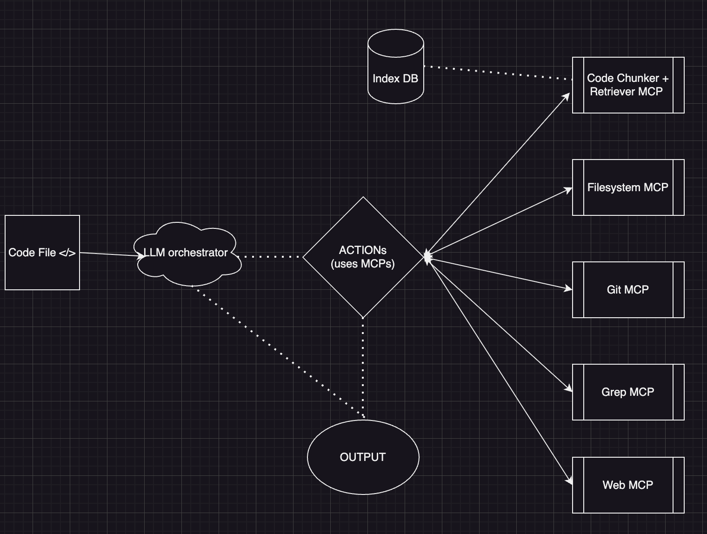

# Implementation of Code Review Bot (Name of the applcation yet to decide).

## High-Level Architecture

### Components
1. `LLM Orchestrator`: (Main LLM that orchestrates (if agents are used) and uses MCPs and does the action).
2. `Code Chunker + Retriever MCP`: MCP (heart of the application) that chunks the code and indexes the code into the DB and retrieves the code chunks.
3. `Filesystem MCP`: MCP that handle file level operations like read, write, delete, move, copy, rename, etc.
4. `GREP MCP`: MCP that handles grep operations.
5. `Web MCP`: MCP that is used to do the web search if the LLM needs to search the web.
6. `GIT MCP`: MCP that is used to do the git operations.

### Flow 
1. Code is read by the LLM (step by step, line by line, chunk by chunk)
2. If LLM is ready to provide the output it can provide the output to the user. If not, it does actions like interacting the MCPs and does the actions and gives the output to the user.
3. Code chunker + Retriever MCP indexes the code into the DB and retrieves the code chunks, internally does the semantic chunks and stores it in the vector DB.

Next steps:
1. Improving the code indexing and retrival.
2. Structuring the code and and make it extensible to integrate multiple LLMs if required.
3. The code should be extensible to add new MCPs if required.
4. Implementing the LLM orchestrator which should be able to connect and detect the avaliable MCPs and use the scratchpad to do the actions.
5. DB implementation (SQLITE or FAISS or any other vector DB), to store the code chunks and retrieve them.
6. Planing a structure such that the code should not be indexed multiple times as the branch is changed.(Complex task), requires a separate DB to store the info.